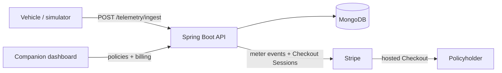
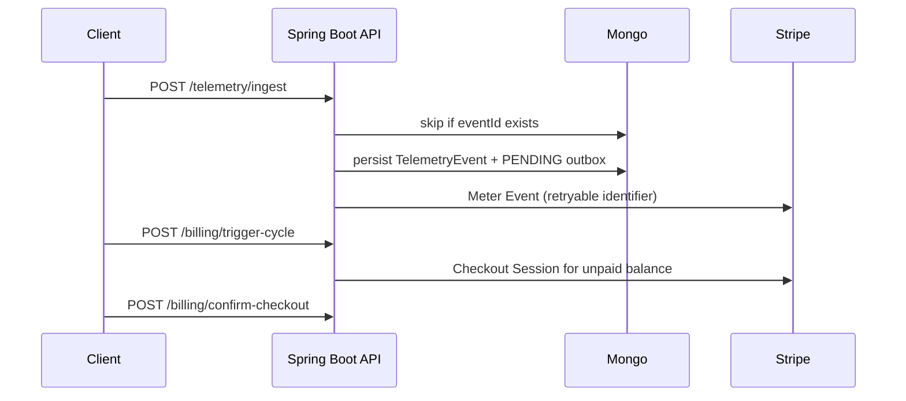

# UBI Telematics Billing Engine

Spring Boot 3 / Java 21 backend for **usage-based insurance (UBI)**. It ingests simulated vehicle telemetry, scores a usage/risk charge, persists an audit/outbox row, reports billable units to **Stripe Billing Meter Events**, and collects unpaid accrued premium through **Stripe Checkout**.

The companion dashboard is a separate repo. CORS and Checkout return URLs follow the live dashboard origin (localhost, LAN, or HTTPS tunnel) instead of a hardcoded path.

> **Security:** `atlas-credentials.env` was previously committed with MongoDB Atlas credentials. **Rotate that Atlas database user now** and purge the file from git history. See [Security](#security). Do not copy real keys into this repo.

## Stack

- Java 21, Spring Boot 3.5 (Web, Validation, Data MongoDB)
- MongoDB
- Stripe Java SDK (`stripe-java` 33.x) — Meter Events + Checkout Sessions

## Architecture





### Design choices

| Choice | Why |
| --- | --- |
| **Idempotent telemetry ingest** | `eventId` is the Mongo `_id`. Duplicates (including races) are accepted and ignored so a retried trip is not double-billed. |
| **Billing outbox + Stripe meter retries** | Each scored event writes a `BillingUsageRecord` *before* Stripe is called. A scheduler retries `PENDING`/`FAILED` rows with a deterministic meter `identifier`, so reporting can fail independently of ingest. |
| **Checkout for monthly collection** | `POST /api/v1/billing/trigger-cycle/{policyId}` opens a Stripe Checkout Session for unpaid accrued premium. `POST /api/v1/billing/confirm-checkout` verifies the session and increments `paidAmountCents` (idempotent per session). |

Only **ACTIVE** policies accept billable telemetry or monthly billing.

**Accrual:** `accruedPremium = basePremium + sum(usageCharge)` · `unpaidAmountCents = max(0, accruedCents − paidAmountCents)`.

## Quick start (Docker Compose)

Requires Docker. No committed secrets: Compose Mongo has no auth, and Stripe keys default to placeholders (`sk_test_replace_me`). The API boots; meter reporting and Checkout need real test keys.

```bash
cp .env.example .env   # optional; edit Stripe keys to exercise billing
docker compose up --build
```

API: `http://localhost:8080`. Mongo is on `localhost:27017`.

```bash
curl http://localhost:8080/api/v1/policies
```

Stop with `Ctrl+C` or `docker compose down`. Data is in the `ubi-mongo-data` volume (`docker compose down -v` to wipe).

## Run with Maven (host)

Prerequisites: Java 21, Maven, and MongoDB (the Compose `mongo` service is enough).

```bash
cp src/main/resources/application-local.yml.example \
   src/main/resources/application-local.yml
# put Stripe test keys in application-local.yml, then:
mvn spring-boot:run -Dspring-boot.run.profiles=local
```

`application-local.yml` is gitignored. Equivalent env vars are listed below. Defaults live in `src/main/resources/application.yml`.

One-time Stripe Customer + Billing Meter (`ubi_telematics_usage`):

```bash
./scripts/setup-stripe.sh
```

Prints a `cus_…` id for the dashboard (`VITE_STRIPE_CUSTOMER_ID`).

### Environment variables

| Variable | Purpose |
| --- | --- |
| `MONGODB_URI` | Mongo connection (host default `mongodb://localhost:27017/ubi_billing`; Compose app uses `mongodb://mongo:27017/ubi_billing`) |
| `MONGODB_DATABASE` | Database name (default `ubi_billing`) |
| `STRIPE_SECRET_KEY` | Stripe secret (`sk_test_…`). Non-blank at boot (`@NotBlank`); placeholders start the app |
| `STRIPE_PUBLISHABLE_KEY` | Stripe publishable key (`pk_test_…`) |
| `STRIPE_TELEMATICS_METER_EVENT_NAME` | Meter event name (default `ubi_telematics_usage`) |
| `BILLING_RETRY_FIXED_DELAY_MS` | Outbox retry interval (default `60000`) |
| `BILLING_CHECKOUT_SUCCESS_URL` / `BILLING_CHECKOUT_CANCEL_URL` | Fallback Checkout redirects if the dashboard omits `returnOrigin` |
| `BILLING_ALLOWED_RETURN_ORIGINS` | Extra Checkout return origins, comma-separated |
| `PORT` | HTTP port (default `8080`) |

## Risk calculation

```text
speedMultiplier     = 1.50 if speedKmh >= 100
                    = 1.20 if speedKmh >= 50
                    = 1.00 otherwise
distanceCost        = (distanceTraveledKm * 0.5) * speedMultiplier
hardBrakingPenalty  = 5  (if isHardBraking)
usageCharge         = distanceCost + hardBrakingPenalty
billableUsageUnits  = ceil(usageCharge)
```

Example (matches the ingest sample below): `12.4 km` at `72 km/h` with a hard brake → `(12.4 * 0.5) * 1.20 + 5 = 12.44` → **13** meter units.

## API

Base URL: `http://localhost:8080`.

### Policies

```bash
curl http://localhost:8080/api/v1/policies

curl -X POST http://localhost:8080/api/v1/policies \
  -H "Content-Type: application/json" \
  -d '{
    "userId": "user_123",
    "stripeCustomerId": "cus_test_customer",
    "basePremium": 100.00,
    "status": "ACTIVE"
  }'

curl http://localhost:8080/api/v1/policies/PASTE_POLICY_ID

curl -X PATCH http://localhost:8080/api/v1/policies/PASTE_POLICY_ID/status \
  -H "Content-Type: application/json" \
  -d '{"status":"SUSPENDED"}'

curl -X DELETE http://localhost:8080/api/v1/policies/PASTE_POLICY_ID
```

Create returns `name` like `Policy_1`, plus `accruedPremium`, `paidAmountCents`, `unpaidAmountCents`, and `premiumPaymentStatus`. Delete also removes that policy’s telemetry events and billing outbox rows.

### Telemetry

```bash
curl -X POST http://localhost:8080/api/v1/telemetry/ingest \
  -H "Content-Type: application/json" \
  -d '{
    "eventId": "evt_trip_001",
    "policyId": "PASTE_POLICY_ID",
    "timestamp": "2026-08-20T10:00:00Z",
    "speedKmh": 72,
    "isHardBraking": true,
    "distanceTraveledKm": 12.4
  }'

curl http://localhost:8080/api/v1/telemetry/history/PASTE_POLICY_ID
```

Ingest returns `HTTP 202 Accepted`. Replaying the same `eventId` does not double-charge. History is newest-first and includes `surchargeAdded` and `riskLevel`.

### Billing (Checkout)

```bash
curl -X POST "http://localhost:8080/api/v1/billing/trigger-cycle/PASTE_POLICY_ID" \
  -H "Content-Type: application/json" \
  -d '{"returnOrigin":"http://localhost:5173"}'

curl -X POST http://localhost:8080/api/v1/billing/confirm-checkout \
  -H "Content-Type: application/json" \
  -d '{"policyId":"PASTE_POLICY_ID","sessionId":"cs_test_PASTE_SESSION_ID"}'
```

Trigger outcomes: `checkout_pending` (hosted URL in `hostedInvoiceUrl`), `already_paid`, or `zero_balance`. Optional `?force=true` creates a new session even when unpaid is already covered.

`returnOrigin` should be the dashboard origin. If omitted, the API uses the request `Origin` header, then `BILLING_CHECKOUT_SUCCESS_URL`. Allowed: localhost, private LAN IPs, HTTPS tunnels (ngrok / Cloudflare / localtunnel), `*.vercel.app` / `*.netlify.app` / `*.onrender.com`, plus `BILLING_ALLOWED_RETURN_ORIGINS`.

Pay with test card `4242 4242 4242 4242`. Confirm verifies the session in Stripe and records `paidAmountCents`.

Meter events use `event_name` `stripe.telematics-meter-event-name` (default `ubi_telematics_usage`), `payload[stripe_customer_id]`, `payload[value]` = billable units, and a deterministic `identifier` derived from the telemetry event.

## Layout

```text
com.example.ubi
├── api            PolicyController, TelemetryController, BillingController
├── application    ingest, risk, outbox, Stripe, billing cycle
├── config         Stripe / billing properties, CORS, Checkout return URLs
├── domain         Policy, TelemetryEvent, BillingUsageRecord + repositories
├── dto            request/response records
└── exception      API error handling

scripts/setup-stripe.sh
src/main/resources/application.yml
src/main/resources/application-local.yml.example
.env.example
Dockerfile
docker-compose.yml
```

## Current limitations / Phase 1+ backlog

Not in this hygiene pass:

- No authentication / authorization
- No automated tests
- No Stripe webhooks (client-side Checkout confirm only)
- Risk scoring is intentionally simple
- Stripe Customer / Meter must be bootstrapped once (`scripts/setup-stripe.sh`)
- Monthly collection is Checkout-based, not server-side auto-charge

Suggested next work: unit/integration tests, ingest/API auth, Stripe webhooks, richer risk factors, billing reconciliation APIs.

## Security

`atlas-credentials.env` (MongoDB Atlas username, password, and `MONGODB_URI`) was committed on `main`. Removing it from the current tree is **not** enough — the blob remains in git history.

**Owner must do this manually:**

1. **Rotate** the leaked Atlas database user (reset password or replace the user) in MongoDB Atlas. Update Render / local env with the new URI. Treat the old password as public.
2. **Purge history** after this PR is merged (do this on a coordinated force-push; it rewrites every commit that contained the file):

```bash
# Preferred
git filter-repo --invert-paths --path atlas-credentials.env

# Or BFG
bfg --delete-files atlas-credentials.env
git reflog expire --expire=now --all && git gc --prune=now --aggressive
git push --force --all
```

3. Keep secrets out of git: copy `.env.example` → `.env` and `application-local.yml.example` → `application-local.yml`. Both patterns are gitignored (`*.env` except `.env.example`).
